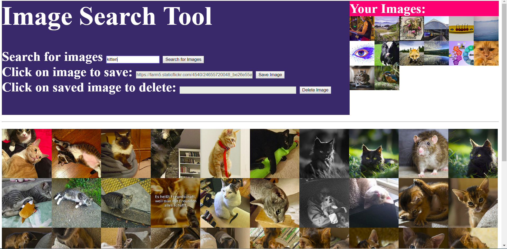

# flickrimagesearch

## What Is It?
Flickr image search gives you the ability to search against the flickr api for a search text and then save images to a cache. You can search across all of flickr for any text that you wish to search on. 

## How Does it Work?
Upon search for a search text, a request is sent to the Flickr API with the method "flickr.photos.search." The flickr API will return a list of ids of images that match that search term. This app will then do an API call with the method "flickr.photos.getSizes" for each image id and extract the thumbnail size image from the response. 

For saving images, a base 64 bytestream is written to the database. 

## Where is the Flickr API? 

The Flickr API can be found here: 
https://www.flickr.com/services/api/

## How to Run
1) Create a virtualenv --> virtualenv <your folder name> --no-site-packages
2) Activate the virtualenv with either "Scripts/activate.bat" on Windows or "source bin/activate" on Mac/Linux
3) git clone this repo into the virtual env folder
4) Install the requirements -->from the directory with the requirements.txt file,  pip install -r requirements.txt
5) Run migrations --> from directory with manage.py, python manaage.py runserver
6) Go to webpage --> From your browser go to localhost:8000
